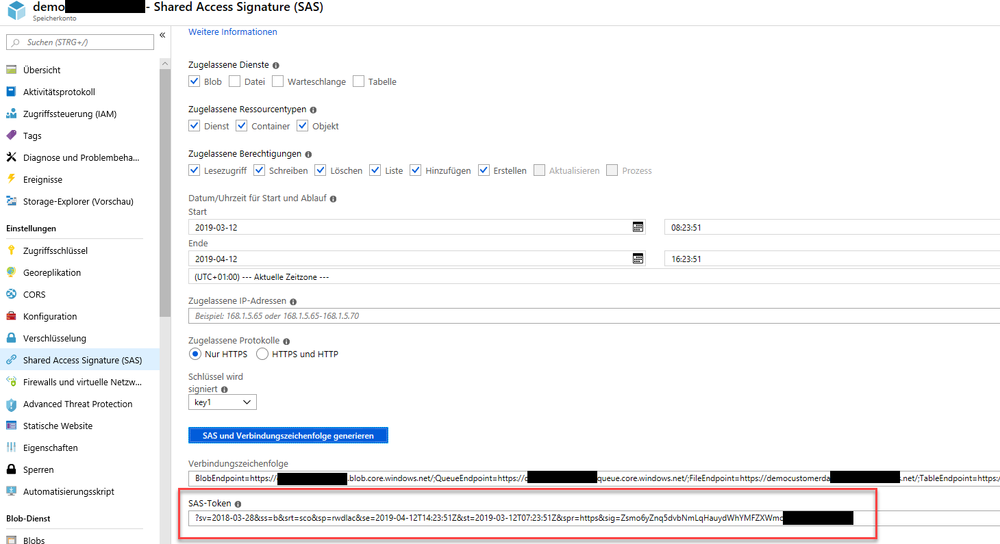
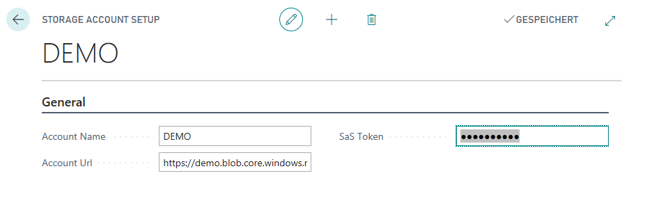
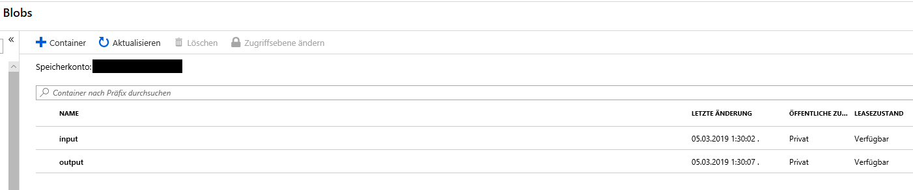
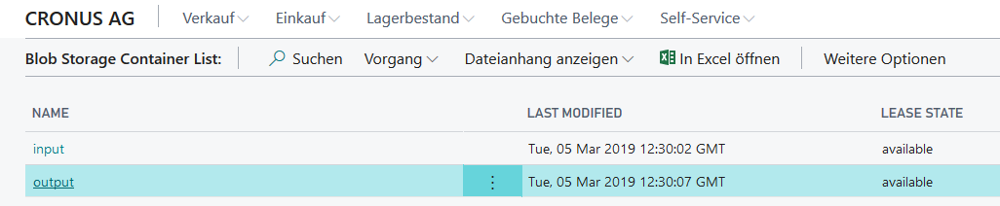
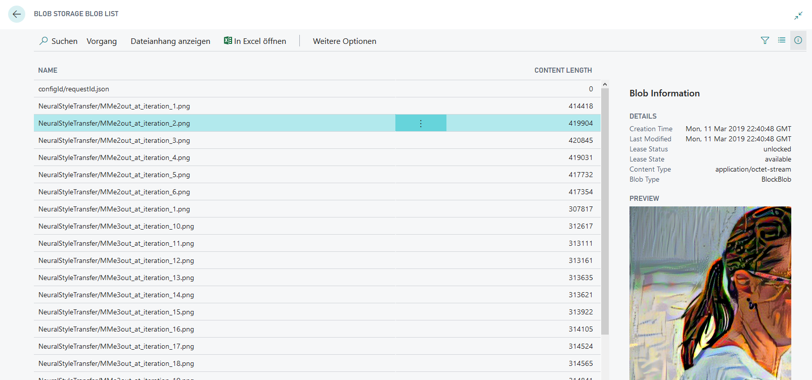
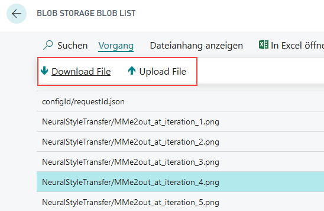
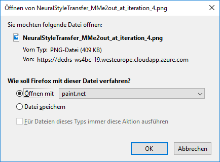

# MSDyn365BC-BlobService-REST-API

This open source library uses the **Azure Blob Service** from **Microsoft Dynamics 365 Business Central** to access your storage account, containers and blobs.

See also here: [**Blob Service REST API**](https://docs.microsoft.com/en-us/rest/api/storageservices/blob-service-rest-api)

***Disclaimer:*** ...please keep in mind, this example does not cover every aspects and **is provided "AS IS"**. Feel free to improve, contribute, use this example as an inspiration or contact me, if you have some ideas ;)

## Authentication

In each scenario, authentication is in my opinion the hardest challenge. Azure Blob Service API  is an important service and well secured.

One way, is to use [Authorize with Shared Key](https://docs.microsoft.com/en-us/rest/api/storageservices/authorize-with-shared-key). For this, enter your [Azure Portal](https://portal.azure.com) and generate a SaS-Token for your Storage Account:



**SaS-Token Example:**

```code
sv=2018-01-28&ss=b&srt=sco&sp=rwdlac&se=2019-04-12T14:23:51Z&st=2019-03-12T07:23:51Z&spr=https&sig=Zsmo45gte5dvbNwRzCauydWhYMFZXWmoIdzR8prGGxw%3D
```

|Token|Description|Example|
|-|:-|-|
|`sv`|Storage services version|`sv=2018-01-28`|
|`st`|Start time|`st=2019-01-12T07:23:51Z`|
|`se`|Expiry time|`se=2019-04-12T14:23:51Z`|
|`ss`|Resource (b=blob, f=files, q=queue, t=table)|`ss=b`|
|`sp`|Permissions (r=read, w=write, d=delete, l=list, a=add, etc)|`sp=rwdlac`|
|`srt`|Resource Types (s=service, c=container, o=blob object)|`srt=sco`|
|`spr`|Protocol|`spr=https`|
|`sig`|Signature|`Zsmo45gte5dvbNwRzCauydWhYMFZXWmoIdzR8prGGxw=`|
|`sip`|Allowed IP Addresses||

*(Please see [Constructing-an-Account-SAS](https://docs.microsoft.com/en-us/rest/api/storageservices/Constructing-an-Account-SAS?redirectedfrom=MSDN) for more details)*

## Simulation

When you start with any API, it's better to simulate your HTTP calls. I use [Visual Studio Code](https://code.visualstudio.com) with the [REST Client](https://marketplace.visualstudio.com/items?itemName=humao.rest-client) extension. This allows to include the simulation files into my workspace and I can run them when to prepare my API calls and, when I do some troubleshooting.

The current API capture these methods and calls:

|Method|Simulation|
|-|-|
|[List Containers](https://docs.microsoft.com/en-us/rest/api/storageservices/list-containers2)|[list.containers.http](./Simulation/list.containers.http)|
|[List Blobs](https://docs.microsoft.com/en-us/rest/api/storageservices/list-blobs)|[list.blobs.http](./Simulation/list.blobs.http)|
|[Get Blob](https://docs.microsoft.com/en-us/rest/api/storageservices/get-blob)|[get.blob.http](./Simulation/get.blob.http)|
|[Put Blob](https://docs.microsoft.com/en-us/rest/api/storageservices/put-blob)|[put.blob.http](./Simulation/put.blob.http)|

To run these HTTP calls, replace the variables with your storage account information.

### Simulate - List Containers

```code
### Change these variables:
@account = <storage-account-name>
@sasToken = <sas-token>
###

### LIST Containers for Storage Account
GET https://{{account}}.blob.core.windows.net/?comp=list&{{sasToken}}
```

The result is XML:

```xml
<?xml version="1.0" encoding="utf-8"?>
<EnumerationResults ServiceEndpoint="https://myaccount.blob.core.windows.net/">
  <Containers>
    <Container>
      <Name>demo-in</Name>
      <Properties>
        <Last-Modified>Sat, 09 Mar 2019 18:51:18 GMT</Last-Modified>
        <Etag>"0x8D6A4C0372195CD"</Etag>
        <LeaseStatus>unlocked</LeaseStatus>
        <LeaseState>available</LeaseState>
        <HasImmutabilityPolicy>false</HasImmutabilityPolicy>
        <HasLegalHold>false</HasLegalHold>
      </Properties>
    </Container>
    ...
  </Containers>
  <NextMarker />
</EnumerationResults>
```

### Simulate - List Blobs

```code
### Change these variables:
@account = <storage-account-name>
@container = <container-name>
@sasToken = <sas-token>
###

### LIST Blobs for Storage Account Container
GET https://{{account}}.blob.core.windows.net/{{container}}?restype=container&comp=list&{{sasToken}}
```

The result is XML:

```xml
<?xml version="1.0" encoding="utf-8"?>
<EnumerationResults ServiceEndpoint="https://myaccount.blob.core.windows.net/" ContainerName="demo-in">
  <Blobs>
    <Blob>
      <Name>example.jpg</Name>
      <Properties>
        <Creation-Time>Sat, 09 Mar 2019 23:03:43 GMT</Creation-Time>
        <Last-Modified>Sat, 09 Mar 2019 23:03:43 GMT</Last-Modified>
        <Etag>0x8D6A4E37A3C6BD0</Etag>
        <Content-Length>94099</Content-Length>
        <Content-Type>image/jpeg</Content-Type>
        <Content-Encoding />
        <Content-Language />
        <Content-MD5 />
        <Cache-Control />
        <Content-Disposition />
        <BlobType>BlockBlob</BlobType>
        <AccessTier>Hot</AccessTier>
        <AccessTierInferred>true</AccessTierInferred>
        <LeaseStatus>unlocked</LeaseStatus>
        <LeaseState>available</LeaseState>
        <ServerEncrypted>true</ServerEncrypted>
      </Properties>
    </Blob>
    ...
  </Blobs>
  <NextMarker />
</EnumerationResults>
```

### Simulate - Get Blob

```code
### Change these variables:
@account = <storage-account-name>
@container = <container-name>
@blobName = <blob-name>
@sasToken = <sas-token>
###

### GET a Blob form Storage Account Container
GET https://{{account}}.blob.core.windows.net/{{container}}/{{blobName}}?{{sasToken}}
```

The result contains the blob content as stream / text.

### Simulate - Put Blob

```code
### Change these variables:
@account = <storage-account-name>
@container = <container-name>
@blobName = <blob-name>
@sasToken = <sas-token>
@length = 0
###

### Store a file as Blob in a Storage Account Container
PUT https://{{account}}.blob.core.windows.net/{{container}}/{{blobName}}?{{sasToken}}
x-ms-blob-type: BlockBlob
Content-Length: {{length}}
```

The file is stored in the content and the **length** must be correct. This simulation example creates / stores an empty file.

## MSDyn365BC API for Blob Service

The API is implemented in Codeunit [`MME Blob Service API`](./App/src/codeunit/Cod50101.BlobServiceAPI.al). Following methods are covered:

```javascript
// List Containers from Blob Storage
procedure ListContainers(var containers: Record "MME BlobStorage Container" temporary): Boolean;

// List Blobs from Blob Storage Container
procedure ListBlobs(containerName: Text; var blobs: Record "MME BlobStorage Blob" temporary): Boolean;

// Get Blob from Blob Storage Container
procedure GetBlob(containerName: Text; blobName: Text; var text: Text): Boolean;
procedure GetBlob(containerName: Text; blobName: Text; var stream: InStream): Boolean;

// Put Blob to Blob Storage Container
procedure PutBlob(containerName: Text; blobName: Text; var text: Text): Boolean;
procedure PutBlob(containerName: Text; blobName: Text; var stream: InStream): Boolean;

// Get Url for Blob
procedure GetBlobUrl(containerName: Text; blobName: Text): Text;
```

|Table|Description|
|-|-|
|[MME Blob Storage Account](./App/src/table/Tab50100.BlobStorageAccount.al)|Storage Account Information|
|[MME Blob Storage Account](./App/src/table/Tab50101.BlobStorageContainer.al)|Container Information|
|[MME Blob Storage Account](./App/src/table/Tab50102.BlobStorageBlob.al)|Blob Information|

## D365BC Example

### Setup the Storage Account in D365BC

The example store information about the storage account in table `MME BlobStorage Account`. To setup you can use page `Setup Storage Account`:



### Storage Account - Containers

Your Storage Account in your Azure Portal provides a list of the containers, allow to create new containers or delete existing containers:



For Dynamics 365 Business Central I added the page "Blob Storage Container List" ([`MME BlobStorage Container List`](./App/src/page/Pag50101.BlobStorageContainerList.al)).



### Storage Account - Containers Blobs

When you open a container from your Storage Account in your Azure Portal, it shows a list of the blobs. You can also upload, download or delete blobs in this page.


The blobs of a container are listed by page "Blob Storage Blob List" ([`MME BlobStorage Blob List`](./App/src/page/Pag50102.BlobStorageBlobList.al)). This page contains also a preview (JavaScript Control-Add-In) to show the Image or Text in a factbox.



This page allows currently to upload and download blobs ***... feel free to contribute new content and functionality!!!***


